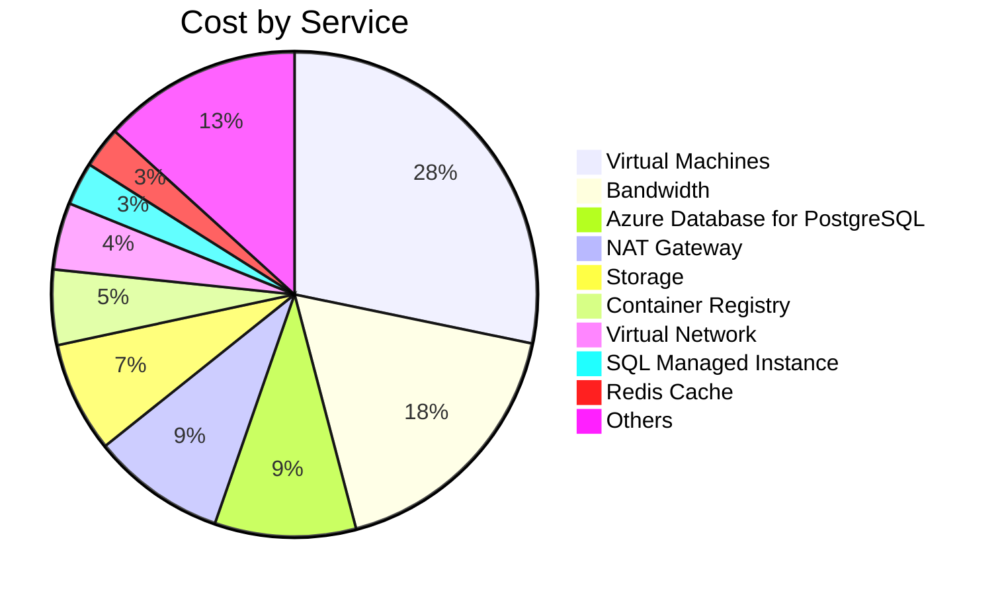
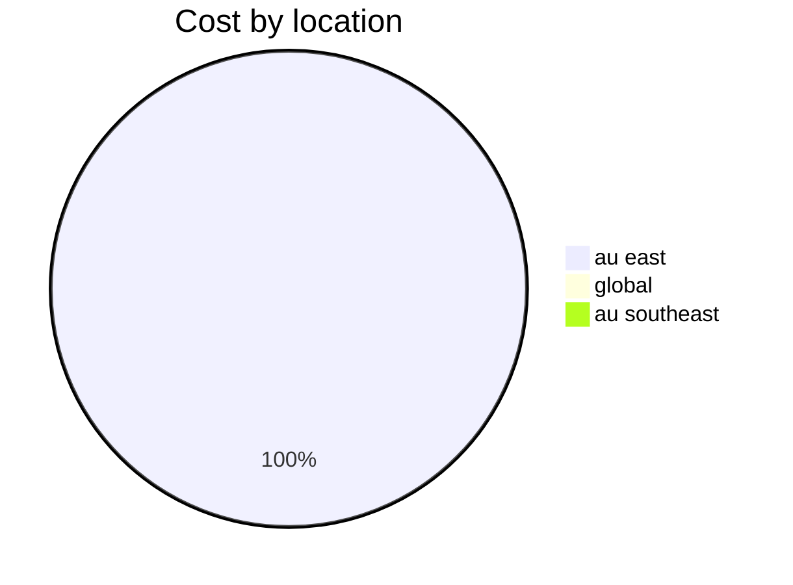
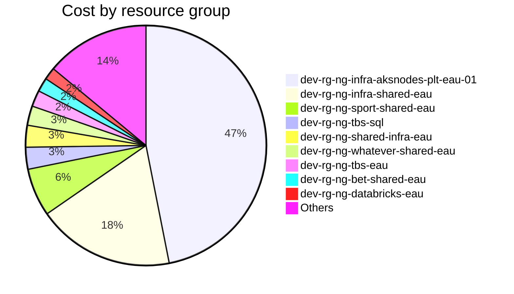

# Azure Cost Overview

> Accumulated cost for subscription id `nextgen-dev` from **03/01/2025** to **03/16/2025**

## Totals

| Period                  |       Amount |
| ----------------------- | -----------: |
| Today                   |   130.42 AUD |
| Yesterday               |   434.52 AUD |
| Last 7 days             | 3,008.48 AUD |
| Last 30 days            | 6,246.53 AUD |
| Total cost in timeframe | 6,246.53 AUD |

```mermaid
gantt
   title Accumulated cost
   dateFormat  X
   axisFormat %s
   section 01 Mar
   AUD 384.01 :0, 38401
   section 02 Mar
   AUD 793.35 :0, 79335
   section 03 Mar
   AUD 1222.56 :0, 122256
   section 04 Mar
   AUD 1627.81 :0, 162781
   section 05 Mar
   AUD 2034.30 :0, 203430
   section 06 Mar
   AUD 2438.58 :0, 243858
   section 07 Mar
   AUD 2846.43 :0, 284643
   section 08 Mar
   AUD 3238.05 :0, 323805
   section 09 Mar
   AUD 3607.75 :0, 360775
   section 10 Mar
   AUD 4002.87 :0, 400287
   section 11 Mar
   AUD 4399.12 :0, 439912
   section 12 Mar
   AUD 4825.54 :0, 482554
   section 13 Mar
   AUD 5247.23 :0, 524723
   section 14 Mar
   AUD 5681.60 :0, 568160
   section 15 Mar
   AUD 6116.11 :0, 611611
   section 16 Mar
   AUD 6246.53 :0, 624653
   section 17 Mar
   AUD 6643.57 : done, 0, 664357
   section 18 Mar
   AUD 7034.22 : done, 0, 703422
   section 19 Mar
   AUD 7427.90 : done, 0, 742790
   section 20 Mar
   AUD 7818.87 : done, 0, 781887
   section 21 Mar
   AUD 8206.08 : done, 0, 820608
   section 22 Mar
   AUD 8574.22 : done, 0, 857422
   section 23 Mar
   AUD 8941.32 : done, 0, 894132
   section 24 Mar
   AUD 9324.35 : done, 0, 932435
   section 25 Mar
   AUD 9701.01 : done, 0, 970101
   section 26 Mar
   AUD 10080.68 : done, 0, 1008068
   section 27 Mar
   AUD 10457.65 : done, 0, 1045765
   section 28 Mar
   AUD 10830.87 : done, 0, 1083087
   section 29 Mar
   AUD 11185.01 : done, 0, 1118501
   section 30 Mar
   AUD 11538.10 : done, 0, 1153810
   section 31 Mar
   AUD 11907.13 : done, 0, 1190713
```

## By Service Name

| Service                       |       Amount |
| ----------------------------- | -----------: |
| Virtual Machines              | 1,764.41 AUD |
| Bandwidth                     | 1,103.37 AUD |
| Azure Database for PostgreSQL |   588.13 AUD |
| NAT Gateway                   |   557.45 AUD |
| Storage                       |   461.36 AUD |
| Container Registry            |   312.99 AUD |
| Virtual Network               |   279.15 AUD |
| SQL Managed Instance          |   179.16 AUD |
| Redis Cache                   |   171.90 AUD |
| Others                        |   828.61 AUD |

## By Location

| Location     |       Amount |
| ------------ | -----------: |
| au east      | 6,228.15 AUD |
| global       |    18.39 AUD |
| au southeast |     0.00 AUD |

## By Resource Group

| Resource Group                      |       Amount |
| ----------------------------------- | -----------: |
| dev-rg-ng-infra-aksnodes-plt-eau-01 | 2,929.82 AUD |
| dev-rg-ng-infra-shared-eau          | 1,152.58 AUD |
| dev-rg-ng-sport-shared-eau          |   403.25 AUD |
| dev-rg-ng-tbs-sql                   |   184.72 AUD |
| dev-rg-ng-shared-infra-eau          |   184.00 AUD |
| dev-rg-ng-whatever-shared-eau       |   162.81 AUD |
| dev-rg-ng-tbs-eau                   |   136.83 AUD |
| dev-rg-ng-bet-shared-eau            |   116.85 AUD |
| dev-rg-ng-databricks-eau            |   103.32 AUD |
| Others                              |   872.36 AUD |

Generated at 2025-03-16 11:36:31 for subscription with id `75d2fa14-67cf-41aa-9717-875861f4f0d7`
